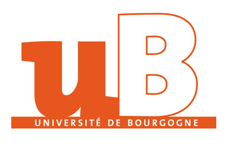

## MSFT PROJECT MSCV

This repo will have all the topics covered during msft visual servoing practicals

division of work, work plan
how the work was shared
goals
methods
conclusion
difficulties
demerits(what happened if...unit testing)Analysis of project
future scope
refrence

<p align="center">  
   
</p >

 <p align="center">University of Burgundy
</p >
<p align="center">Master of Computer vision and Robotics</p > 
<p align="center">  
   
</p >


<p align="center">Under the guidance of:</p > 
<p align="center"> Omar TAHRI </p >     
<p align="center">Team Members:</p >
<p align="center">REETIKA GAUTAM</p>
<p align="center">SEIKH MOHAMMED BASHARAT MONES</p>


TABLES OF CONTENTS:


 1. [Introduction](https://github.com/zainbinsumait/Multi_Sensor_Fusion_and_Tracking#introduction)
	1. [Architecture of our Approach]
	
 1. [Camera Calibration](https://github.com/zainbinsumait/Multi_Sensor_Fusion_and_Tracking#camera-calibration)

 2. [3D pose estimation by using Aruco Marker](https://github.com/zainbinsumait/Multi_Sensor_Fusion_and_Tracking#detection-and-pose-estimation)

 3. [Transforming the system to Robot Frame](https://github.com/zainbinsumait/Multi_Sensor_Fusion_and_Tracking#frame-transformation)

 4. [Control Used](https://github.com/zainbinsumait/Multi_Sensor_Fusion_and_Tracking#control-system)

 5. [Integration of Aruco marker with ROS ](https://github.com/zainbinsumait/Multi_Sensor_Fusion_and_Tracking#integration-of-ros)
    1) [ What is ROS: ](https://github.com/zainbinsumait/Multi_Sensor_Fusion_and_Tracking#1-what-is-ros)

    2) [ What is the publisher and Subscriber](https://github.com/zainbinsumait/Multi_Sensor_Fusion_and_Tracking#2-what-is-the-publisher-and-subscriber)

7. [Implementation of working code]

    1) [Launch the Robot](https://github.com/zainbinsumait/Multi_Sensor_Fusion_and_Tracking#3-launch-the-robot)
    2) [Launch the Ueye Camera](https://github.com/zainbinsumait/Multi_Sensor_Fusion_and_Tracking#4-launch-the-camera)
    3) [Launch the Aruco Markers to get the pose]
    4) [rosrun the Control loop]
    5) [ Demo video of robo parking]
    6) [Demo video of robo visual servoing ghoomar ghoomar]
    

 7. [Obstacle avoidance using Lidar Data](https://github.com/zainbinsumait/Multi_Sensor_Fusion_and_Tracking#obstacle-avoidance)

    1) [Obstacle detection and avoidance](https://github.com/zainbinsumait/Multi_Sensor_Fusion_and_Tracking#1-obstacle-detection)
    2) [Demo video]
    3) [The ambiguity in the LIdar Data](https://github.com/zainbinsumait/Multi_Sensor_Fusion_and_Tracking#2-the-algorithm-developed)
    4) [Final Demo of Robot avoiding the obstacle](https://github.com/zainbinsumait/Multi_Sensor_Fusion_and_Tracking#3-similar-rrt-algorithm)

 8. [Conclusion and learning outcome](https://github.com/zainbinsumait/Multi_Sensor_Fusion_and_Tracking#conclusion)
 
 9. [References]


# Introduction:

Visual servoing is a control technique used in robotics to control the motion of a robot using visual feedback from a camera. It involves using visual information from the robot's environment to control the motion of its end effector, or the part of the robot that interacts with its surroundings. Visual servoing allows robots to perform tasks such as tracking a moving object, following a predetermined path, or manipulating objects in their environment. This technique can be used in a variety of applications, including manufacturing, healthcare, and search and rescue operations.

For our project we will demontrate a real time visual servoing performed on TurtleBot3- Burger to follow a defined target from an UEYE-camera using the configuration (Eye-to-hand) configuration uisng ROS noetic :

* The first objective is to move the robot from an initial position to a Target position considering the target orientation (Parking).

*  The second task is to make the robot follow the optimal path to target by avoiding the obstacle encountered on it's way.

# Architechture of our model

*  Launch video feed from Ueye_cam

*  Camera calibration

*  Pose initial and target robot estimation

*  control system

*  Integration of ROS

*  Obstacle avoidance

![[Pasted image 20221213151923.png]]


# Camera Calibration:

Camera Calibration is the process of estimating the intrinsic and extrinsic parameters. Intrinsic parameters refer to the internal characteristics of the camera, such as focal length, tilt, distortion, and image center. The extrinsic parameters describe the position and its orientation in the real (X, Y, Z) frame.

![[Pasted image 20221213152811.png]]

**This is the first step we must take before doing anything else.**


**The intrinsic parameters are:**

_f_: the focal length.

_Ku, Kv_: the image magnification factors.

_Cu, Cv:_ the coordinates of the projection of the optical center of the camera on the image plane.

_Suv:_ which reflects the potential non-orthogonality of rows and columns of electronic cells that make up the camera sensor. Most of the time, this parameter is neglected and therefore takes a zero value.

**The extrinsic parameters are:**


**_R3x3_**: which is the rotation matrix allowing to pass from the reference frame linked to the working space to the reference frame linked to the camera.

_tx ty tz_: which are the components of the translation vector allowing to pass from the reference frame linked to the working space to the reference frame linked to the camera.

In total, there are 12 parameters to be estimated (the rotation matrix R contains 9 elements, but the relation that defines it as a rotation matrix R. RT = 1 reduces the number of independent elements to 3: the 3 polar angles).


To calibrate our camera we camera_calibration ROS package as shown below.

And it generates a zip file with all the images taken during the calibration and also a .yaml file which contains the calibrated camera parameters.

To run this command in terminal:

```bash
rosrun camera_calibration cameracalibrator.py --size 7x5 --square 0.12 image:=/camera/image_raw camera:=/camera
```

**Example of camera calibration data matrix:**

![[calibration_data.png]]


# Detection of aruco and 3D pose estimation

Pose estimation refers to the process of determining the orientation and position of an object in space. This can be useful for a variety of applications, such as augmented reality, robotics, and computer vision.

The objective of this step is to know the initial position of the robot and the target position to plan the trajectory.  A closed loop system based on visual servoing needs real time detection to minimize the error between the objective and the current position.

There are several methods to detect the pose using the camera for example Qrcodes, Aruco markers, or directly using image processing using some filters for detecting the depth of the image etc.

For our model we use the my_aruco package for detection of two markers, one for robot and one for target resoectively . Then, two methods were tested to extract the correct position of the aruco as well as its orientation.

![[BothARUCOwithPose.png]]


A real-world problem is a 3D problem, because of the real condition of the workspace. So, a 3D position is necessary to move the robot in an efficient way. To have this 3D position we are using my_aruco_package  to get pose  of two specific markers, in our case(25 and 701)

![[MicrosoftTeams-image.png]]

Using this information, a transformation matrix can be calculated by computing the rotation matrix from the rotation vector (using Rodriguez function) and then build the transformation matrix.


Using two aruco markers with different ID, we can identify the current robot and the target position in real-time. This method has two advantages:

* 3D position, which allows to solve a 3D navigation.

* Detecting the target and the robot in real-time, which allows the robot to reach the target even if the target is moving (dynamic control).

# Frame transformations

In this step, two transformation matrices are available, one for the current position, and the other for the target position in the camera frame. The objective is to get the target position in the robot frame, so we have all the coordinates and the angles in this frame.


Supposing that: The transformation matrix from the target to the camera is Tcamera_target, and the transformation matrix to the robot is Tcamera_robot, so the Transformation matrix from the target to the robot :    

To do so, we need to combine these two matrices by multiplying the inverse of the [current transformation matrix] of the robot by the [target transformation matrix] to receive the combined transformation matrix (t) which is called:


In python we did that using the following code:

```python
np.linalg.inv(Robot_matrix_transformation).dot(Target_matrix_transformation)
```

# Control loop(flow chart req)

To move the TurtleBot, we need to send the order in a form of value of speed. 3 linear speeds and 3 rotational speeds in xyz axis. Corresponding to the number of degrees of freedom that we have on our robot (1 on x axis, 1 on y axis and 1 for the rotation around the z axis), two linear speeds (in respect of x and y) and one rotational speed (z) are given to the robot to move to a position. Consequently, we need to calculate these speeds first and then send it to the robot. The concept is to reduce the difference between the initial position and the target position. The difference includes the distance between them and the gap between their orientations.


The distance between the two positions (ρ), the angle between the orientation of the robot and the target (θ), the angle between the orientation of the robot and the direction of the target (α)


To reduce the distance, a forward movement toward the target is required. So, a forward speed and a direction must be calculated. Two parameters are responsible (α and ρ)

The forward speed is: 

The third parameter (beta) should be reduced to park the robot in the same orientation as the target.

The speeds are calculated then sent every (1/50) seconds to the robot using ROS. To have a smooth movement, max speed should be determined which allows also to take in consideration the physical constraint of the vehicle.

## Simulation to test the control system(add pictures after simulation)

Simulate the control system using python code, by simulate a robot position which updates its position every time the speed is calculated. The next position is calculated by these equations:
 put equation from slides.

Here we see that our intitial position is defined as [0,0,-90] and we see clearly that our robot to reach the target takes a curved path to justify our control and sucessfully reaches the target of [2,2]


![[Pasted image 20221213165531.png]]

# Integration with ROS

## 1.    What is ROS:

ROS (Robot Operating System) is an open-source software development kit for robotics applications. ROS provides developers across all industries with a standard software platform that enables them to move from research and prototyping to deployment and production. ROS has a concept **Don't reinvent the wheel. Create new things and make them faster and better by building on ROS!**

## 2.    What is the publisher and Subscriber:

Message passing in ROS happens with the Publisher Subscriber Interface provided by ROS library functions.

A ROS Node can be a Publisher or a Subscriber. A Publisher is the one puts the messages of some standard Message Type to a particular Topic. The Subscriber on the other hand subscribes to the Topic so that it receives the messages whenever any message is published to the Topic.

Note that a publisher can publish to one or more Topic and a Subscriber can subscribe to one or more Topic. Also, publishers and subscribers are not aware of each other’s existence. The idea is to decouple the production of information from its consumption and all the IP addresses of various nodes are tracked by the ROS Master.

)

## 3.    Launch the Robot:

The robot is already delivered with all the necessary ROS packages, otherwise you can easily get them by flowing a good tutorial made by ‘ROBOTIS’ [https://emanual.robotis.com/docs/en/platform/turtlebot3/quick-start/](https://emanual.robotis.com/docs/en/platform/turtlebot3/quick-start/)

To launch the robot in the terminal, write these commands:


Till now we started these topics on our robot:


## 4.    Launch the Camera:

To publish our code in the robot, we must get the topics of the camera first; for that there is already Ros packages of the Ueye-camera by installing them from: [https://github.com/anqixu/ueye_cam](https://github.com/anqixu/ueye_cam)


## Move the robot.

This step is to publish the speed calculated by publishing it on the robot’s topic “cmd_vel”. A servoing closed loop that gets the real time image, calculates the velocity, and sends it to the robot by a frequency of 50 Hz. The robot receives the instruction and goes to the target. The robot stops when the distance between the current and the target is about 40 pixels or (40/f)*Z = 5.6 cm (where f is the focal length and Z is the distance to the camera). And for the parking we added another condition to adjust the angle θ, so the robot has the same orientation as the target.


# Obstacle avoidance

Detect and avoid obstacles are important features for a mobile robot to navigate in an unknown environment. First step is detecting the obstacles where simple object detection or deep learning can be used. Second step is the path planning to reach the target.

Numerous of algorithm exist to determine the shortest path like A* and RRT. We chose to develop our own method to avoid obstacles as well as RRT algorithm.

## 1.    Obstacle detection

Detect an object considered as an obstacle needs a computer vision. Depending on the desired result, it can be a simple or a complex detection from shape or colour detection to a deep learning model to detect any object that can be considered as an obstacle. In this project we chose a simple colour detection with a red colour mask to extrait the red objects from the image.


## 2.    The algorithm developed

The input image is divided into squares with the same size as the robot in pixels, then we consider the square with red colour pixels as an obstacle square which can’t be added to the path. Next, for each box a cost is calculated by the following equations:


Where d is the distance from the centre of the square to the target. 

n =  if the square is an obstacle neighbour and n = 0 if not.

This equation returns a cost with an inverse relationship to the distance to the target with a bigger value to the obstacle’s neighbour squares, this gives a safety margin to completely avoid the obstacle.

The algorithm steps:


Applying this algorithm in real life gives us the result in the following figure. The path is as far as it can be from the obstacles to have a safe margin, however, it’s not exactly the optimist way. The algorithm can be improved to calculate the total cost of the path and then try another path as what other algorithms do (A star and RRT).  

The path points are then sent to the control system so that the robot reach each point as it’s finale target. Once it reached to the first point it goes to the second until the end of the path.


## 3.    Similar RRT algorithm

Rapidly exploring Random Tree is an algorithm used in path planning to create a safety path for a trajectory.

Like the RRT process algorithm we try to describe a path that the robot can follow safety to join the target position avoiding the different obstacles.

The RRT algorithm follows the step below.


In first time, around the start point we create a point by using a random vector generate by the goal position and the concept of nearest neighbour. Then we check if this point is not at the position of the obstacle and if it respects the condition due to its distance to the goal position. If this constraint is done, we add it in the path list and restart the process with this point as the start point now. In a small simulation we fixe an obstacle and create the path

.

In the image in green we have different points created by the algorithm. When the point is close to the obstacle, it creates a new point by respecting the constraint due to its distance from him until the robot arrives at the goal.

Now we apply it on an image. First with an algorithm for colour detection we detect the obstacle, and we extract its position. In this case the position is extracted in pixel.

                                    

With this position and the robot and target position we can apply the algorithm to have the path that the robot can follow.

              

# Conclusion

Controlling a robot in an unknown environment add more challenge to the control system and to the detection. Detecting the robot will not be as easy as while using the aruco marker. Moving the robot in a rugged terrain needs a robust control system that takes in consideration the tough surface and the sliding of the wheels. We can use a deep learning algorithm to detect the robot and the target. Using a CNN models to detect the robot without a marker in almost all the situation depending on how strong the model is.

The project allowed us to take on hand several important robotic skills, image processing, visual servoing, path planning, interpretation of the result, frame transformation, and soft skills as well.
